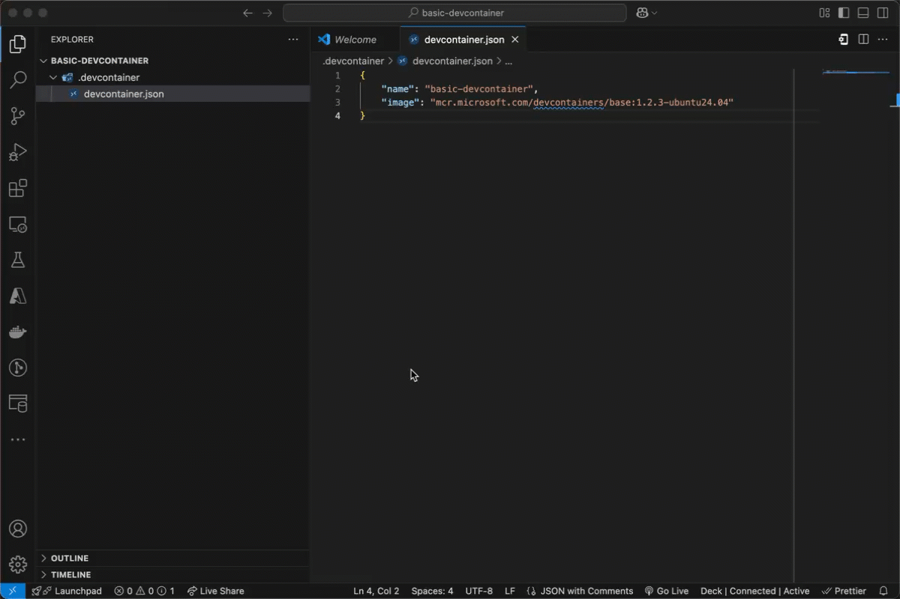

If there's been one innovation that has drastically affected my software development technique over the past year, and it's not AI or LLMs, it's been [development containers](https://containers.dev). Development containers have been a game changer for me in the workflow that I use for developing software products involving APIs, microservices, databases, publish/subscribe messaging, etc. Development containers don't help me out much with mobile application development, but one can dream of future improvements.

Development containers are a different way to use Docker containers. Instead of packaging your applications in a Docker container and running the container in a production environment, development containers let you package up your development tools and use the Docker container for development. Development containers work very similarly to connecting to a remote virtual machine using a tool such as SSH. The primary difference is the support of development environments to work with development containers provide a lot more tools.

The main software that I use that support development containers so far are [Visual Studio Code](https://code.visualstudio.com) and the [JetBrains](https://jetbrains.com) IDEs. I believe that [Visual Studio](https://visualstudio.com) also supports development containers, but I primarily use an Apple MacBook Pro and haven't been able to verify how good the support is for it.

Why development containers? Here's one scenario that happens to me a lot on software projects. When I begin a new software project for a customer, I sit down with the customer and my team and we figure out what programming languages and other software tools that we're going to use for the project. Over time this could evolve and we can add or remove tools, or upgrade to newer versions as they come out. Before we begin working on the software, I or someone on the team will sit down and write out the `README` with incredible detail listing the exact development languages and tools and the specific versions that we are using. Now within the first week of the project, I'll get someone saying that some command isn't working correctly and they'll send me a screenshot on Microsoft Teams where the error is `<command> was not found`. My first question is whether they installed the tool. The typical answer is `no`. What was really meant is that they didn't spend the time to read the `README` before jumping into the source code.

Now, development containers doesn't fully fix this, as there are some requirements necessary just to use development containers. But development containers makes the list of software to onboard smaller, and then the rest is handled by development containers. In the rest of this post, I'll show you how to get started using development containers.

## Where You Can Run Development Containers

Development container support is still evolving and features can be different between environments. There are three places where I've been able to use development containers:

- [Visual Studio Code](https://code.visualstudio.com)
- [JetBrains IDEs](https://jetbrains.com)
- [GitHub CodeSpaces](https://github.com/features/codespaces)

I _believe_ that Visual Studio also supports development containers, but I don't have access to a Windows computer with Visual Studio installed so I cannot verify myself and I have not tested it out.

Visual Studio Code is the gold standard as of the time of this writing for running development containers. Visual Studio Code seems to support all of the features and has some extra added bonuses. One thing I really appreciate with Visual Studio Code's implementation is supporing [Git commit signing](https://docs.github.com/en/authentication/managing-commit-signature-verification/signing-commits). I prefer to sign my Git commits as an extra verification step so that when others see my commits, they can verify that they came from me. Originally, I uses GPG keys to sign my commits, but I have since switched to using [1Password](https://www.1password.com) and [SSH keys](https://developer.1password.com/docs/ssh/git-commit-signing/). When using GPG, I had to remember to change my public key ID for whichever development profile I was signing with (personal, business, corporate, or client). Using SSH, I can use a single key for all of my profiles and I just need to share the public key with GitHub or another tool to validate my commits.

Visual Studio Code implements SSH agent forwarding support so that I can sign my commits in the development container. When I sign the commit, Visual Studio Code forwards the SSH signing request to the SSH agent being run by 1Password on my host machine, and can complete the signature and commit in the development container.

JetBrains support is _good_, but I have not been able to get the SSH Git commit signing thing to work. When I work with development containers in JetBrains IDEs, I typically will create the container against a local copy of the Git repository on my development machine, and then I'll use a terminal and Visual Studio Code in my host environment to sign the commits for changes that I make in the development container. I can deal with it, because there are times that I prefer to be working in a professional IDE like JetBrains.

I've played a little with development containers and GitHub CodeSpaces, but honestly, not enough to give you a full review. Maybe I'll do that in a later blog post.

## Creating a Basic Development Containers

For the rest of this post, I will be using Visual Studio Code to build and use development containers. To get started using development containers on your own, you're going to need three things installed on your development machine:

1. [Visual Studio Code](https://code.visualstudio.com)
1. [Remote Development Extension Pack for Visual Studio Code](https://marketplace.visualstudio.com/items?itemName=ms-vscode-remote.vscode-remote-extensionpack)
1. [Docker Desktop](https://www.docker.com/products/docker-desktop/#)

Once all three are installed, you're ready to go.

The first thing that you need is a base Docker container for your development container. The base Docker container is going to give you the Linux operating system and a starter set of tools that you'll have available in your development container. Any Docker container can be used as a base container. It doesn't need anything special. I typically start with a generic base container that Microsoft published in their public container registry at https://mcr.microsoft.com. Microsoft makes several base containers available featuring programming languages like .NET, but I usually skip these and go straight to their [generic base container](https://mcr.microsoft.com/en-us/artifact/mar/devcontainers/base/about).

Microsoft's generic base container comes with three options for the base Linux operating system: Alpine, Debian, or Ubuntu. I don't usually use Alpine for development, although I do use it for my production containers. For development, I will usually use Debian (Bookworm, or Debian 12) or Ubuntu. For this article, I'll use Ubuntu.

Inside of Visual Studio Code, I will create a new project in an empty folder. The first thing that I will do is to create a `.devcontainer` subdirectory and then create a `devcontainer.json` file in that subdirectory. Visual Studio Code will look in the root directory of projects for a `.devcontainer` subdirectory and a `devcontainer.json` file, and if it finds them, will ask you if you want to reopen the project in a development container.

The `devcontainer.json` file is the specification for the development container. This specification is used by Visual Studio Code to build and run the development container using Docker Desktop. `devcontainer.json` contains the base container image that you are going to use for the development container, along with a list of additional software to install that we'll get to in a moment, settings for Visual Studio Code or other tools, and a list of TCP/IP ports that should be forwarded to the host machine so that you can use a web browser to view a website hosted in the development container.

For the simple case, our `devcontainer.json` file will look like this:

```json
{
    "name": "basic-devcontainer",
    "image": "mcr.microsoft.com/devcontainers/base:1.2.3-ubuntu24.04"
}
```

This is the very minimum that you need to create a development container. If you have this, you can start your development container and use Visual Studio Code to attach to it:



You now have a working development container! If you open a terminal inside of Visual Studio Code, any commands you run are executing from within the development container.

## Installing Additional Software in the Development Container

This base container is only going to take us so far. It doesn't have any programming tools, so while I can still use Visual Studio Code to write code, I can't build it or run it. Let's fix that now.

There are several ways that we can add additional software to our base container. We can create a Dockerfile based on the base container and use commands like `apt-get` to install packages or use `RUN` commands to run scripts to download and install software. We'll do this later in the article. We can also create a shell script that we can run after the development container is created but before we use it. In that shell script, we can add the commands to download and install the software. For many popular tools and programming languages, we can also use something called a __feature__. A feature is like a package specific for development containers. Others have created and published packages that can be reused by others to build and customize their own development containers. These features will install and configure software packages. We'll add a programming language by using a feature.

A list of available features that have been published are available [here](https://containers.dev/features). You can view the whole list or search for a specific package that you are interested in. Let's say for this example that we want [Node.js](https://nodejs.org) to build a JavaScript application in our development container. We can add Node.js to our development container by adding and configuring the [Node.js feature](https://github.com/devcontainers/features/tree/main/src/node). We will update our `devcontainer.json` file by adding the feature to it:

```json
{
    "name": "basic-devcontainer",
    "image": "mcr.microsoft.com/devcontainers/base:1.2.3-ubuntu24.04",
    "features": {
        "ghcr.io/devcontainers/features/node:1": {
            "version": "22.14.0"
        }
    }
}
```

The `ghcr.io/devcontainers/features/node` URI tells Visual Studio Code where it can find the feature's definition. This is a browsable URL. [Click this to see](https://ghcr.io/devcontainers/features/node). The `1` is the version number or tag for the feature. The version number uses [Semantic Versioning](https://semver.org). We can use a specific version such as `1.6.1` (the latest version at the time of writing) or a generic version number such as `1`, which indicates to use the latest version with the major version number `1`.

Inside of the feature specification, I provided a value for the `version` field. Many features allow you to specify the version number of the tool that you want to install, with the default being the latest version. For programming languages and development tools, I like to specify the version number to make it official and to keep developers working on the exact same version of tools. This insulates the development team from any bugs that may be introduced by team members using different tool versions. In this example, I am specifying that I want the project to use Node.js 22.14.0. Within the development container, all developers will be using that version.

## Customizing the Base Container

In certain cases, I need to customize the base container to install something that can't be addressed by a feature. In that case, I need to create a new Docker container based on the base container, but with my customizations. I can do this by creating a `Dockerfile` and updating my `devcontainer.json` to reference the `Dockerfile`. When I do this and open my development container in Visual Studio Code, Visual Studio Code will use the `Dockerfile` to build the new development container image before launching the development container. We can reuse the same base container image specified in `devcontainer.json` when building the new development container image. Here's a `Dockerfile`:

```docker
FROM mcr.microsoft.com/devcontainers/base:1.2.3-ubuntu24.04

# gnupg2 is required for Git commit signing to work in the development
# container.
RUN apt-get update && apt-get install -y gnupg2
```

In this example from one of my development containers, I'm installing `gnupg2` into the container to support Git commit signing using GPG. (I don't technically need this anymore now that I've switched over to SSH commit signing, but I still usually include it for developers that don't have 1Password).

I also typically create a `.dockerignore` file to exclude the development container files from being uploaded to the Docker daemon when the development container image is created:

```plain
.dockerignore
devcontainer.json
Dockerfile
```

We can next update our `devcontainer.json` specification to look like this:

```json
{
    "name": "custom-devcontainer",
    "build": {
        "context": ".",
        "dockerfile": "Dockerfile"
    },
    "features": {
        "ghcr.io/devcontainers/features/node:1": {
            "version": "22.14.0"
        }
    }
}
```

The presence of the `build` field in `devcontainer.json` tells Visual Studio Code that it needs to build the development container image using `Dockerfile`. The `context` field tells Visual Studio Code to use the `.devcontainer` subdirectory as the _context_ for where `Dockerfile` and other files necessary for the development container can be found.

## A Development Container with Service Dependencies

It's rare that I build any software that does not have dependencies. At a minimum, I'm going to have a database such as [Azure SQL](https://azure.microsoft.com/en-us/products/azure-sql/) that I'm using to persist application data. Development containers can have more than one container image using [Docker Compose](https://docs.docker.com/compose/). Docker Compose can be used to launch multiple containers and connects the containers using a virtual network so that they can interact and work with each other. As developers, we can craft our development container to have all of the dependencies necessary (or something close enough to simulate it such as Microsoft SQL Server for Azure SQL) to build, run, and test our applications in the development container.

To begin with, we'll create a `compose.yaml` specification that tells Docker Compose how to build and run our development container:

```yaml
services:
  app:
    build:
      context: .
      dockerfile: Dockerfile
    volumes:
      - ..:/workspace:cached
    command: sleep infinity
    # Required for ptrace-based debuggers like C++, Go, and Rust
    # See https://code.visualstudio.com/docs/devcontainers/create-dev-container#_use-docker-compose
    cap_add:
      - SYS_PTRACE
    security_opt:
      - seccomp:unconfined
```

This specification tells Docker Compose to create a container named `app` based on `Dockerfile`. The `app` container will mount the root directory of my local Git repository in the `app` container at `/workspace`. When the `app` container is started, it will execute the `sleep infinity` command. Because our development container is not running any kind of service, if we start it without a command, the development container will stop immediately and unload. By running it with the `sleep infinity` command, we keep the development container alive so that Visual Studio Code can attach to it and we can get terminal access to the development container.

We can now update our `devcontainer.json` file to use Docker Compose:

```json
{
    "name": "my-project",
    "dockerComposeFile": "compose.yaml",
    "service": "app",
    "workspaceFolder": "/workspace",
    "features": {
        "ghcr.io/devcontainers/features/node:1": {
            "version": "22.14.0"
        }
    }
}
```

I also update my `.dockerignore` file to exclude `compose.yaml`:

```plain
.dockerignore
compose.yaml
devcontainer.yaml
Dockerfile
```

Now if I add a service dependency so that I can develop against it, I can add it to `compose.yaml`. Using my previous example, if I'm building a solution that is being targeted for [Microsoft's Azure Cloud](https://azure.microsoft.com/en-us), I may use Azure SQL for my persistent data. But I can't run Azure SQL locally. I can always use a cloud instance, but it's not as convenient as having a local database to work with. But what I can do is run Microsoft SQL Server. While not 100% compatible, they're pretty close. Microsoft also makes Microsoft SQL Server available as a [Linux-based container](https://mcr.microsoft.com/en-us/artifact/mar/mssql/server/about). We can add it to our `compose.yaml` file:

```yaml
services:
  app:
    build:
      context: .
      dockerfile: Dockerfile
    volumes:
      - ..:/workspace:cached
    command: sleep infinity
    # Required for ptrace-based debuggers like C++, Go, and Rust
    # See https://code.visualstudio.com/docs/devcontainers/create-dev-container#_use-docker-compose
    cap_add:
      - SYS_PTRACE
    security_opt:
      - seccomp:unconfined

  sqlserver:
    image: mcr.microsoft.com/mssql/server:2022-CU16-ubuntu-22.04
    environment:
      - ACCEPT_EULA=Y
      - MSSQL_PID=Developer
      - MSSQL_SA_PASSWORD=${MSSQL_SA_PASSWORD}
    ports:
      - "1433:1433"
    volumes:
      - sqlserver_data:/var/opt/mssql

volumes:
  - sqlserver_data:
```

When I start my development container now, Visual Studio Code is going to launch and connect to my development container, but it's also going to start Microsoft SQL Server. And both the development container and SQL Server will be connected to the same virtual network, so my programs running in the `app` service can connect to SQL Server using the hostname `sqlserver`.

This is an incredible feature that makes building complex services incredibly easy. If I need [Redis](https://redis.io), I can add a Redis container. If I need a publish/subscribe asynchronous message broker, I can add [RabbitMQ](https://www.rabbitmq.com). And unlike using Docker Compose on its own, I don't need to remember to start everything before I begin developing. The services are all started at the beginning of my development session and stopped at the end. If I switch between projects, my environment will change automatically.

## Where Can't I Use Development Containers?

Development containers are great for full-stack and microservice development, but when working with client applications, they're not the right solution. I do a lot of mobile development, especially with [Xcode](https://developer.apple.com/xcode) for building iOS applications. Development containers are based on Linux, not macOS, so I can't use them. Now I can use a development container to host my services and APIs and have the mobile application call them using HTTP, but I can't do mobile application development in development containers. Desktop development also wouldn't work here.

Web development can be done inside of a development container, but debugging using a professional IDE such as JetBrains or the Visual Studio Code debugger may not work so well. The reason is that the web browser is going to run in the host environment and access the web server that is accessible through a TCP/IP port that has been forwarded from the development container to the host environment. The debugger, which is running in the development container, can't connect to the web browser to do debugging. You can debug using the in-browser development tools, but sometimes you really just want to debug in the IDE.

## Testing APIs

I mentioned this in the previous section. While I can't use development containers for client application development, I can test my client application calling APIs in my services that are running in the development container. There are two ways to do this. The first is that I can forward a TCP/IP port from my development container to the host environment, allowing a program running on my computer to connect to a service running in the development container. This is often used for connecting a web browser to a web server running inside of the container.

Another option is to use a port tunneling tool like [ngrok](https://ngrok.com). ngrok publishes a [Docker container](https://hub.docker.com/r/ngrok/ngrok) that you can add as a service to your `compose.yaml` file to create a secure tunnel to your development container's virtual network. The ngrok container will create a secure tunnel with a customizable domain or URL to the public Internet. Your client applications can then use that domain or URL to send requests to your development container. The ngrok container can forward all incoming requests to your `app` service on whatever TCP/IP port your program is listening on.

I will go into this deeper in a future blog post with an example.

## Conclusion

Development containers have been one of the biggest productivity boosters for me as a microservice and full-stack developer over the last couple of years. The integration between Docker technologies and IDEs like Visual Studio Code and JetBrains have made it easy to set up a complete development environment and fix long onboarding times for new developers. Using development containers in my own projects means that developers can get up and running in minutes instead of having to read through long lists of required software and dealing with version conflicts, compatibility issues, and long installation times in their development environments.

In future posts, I'll share some real stories and show you how I'm using development containers in more detail.
