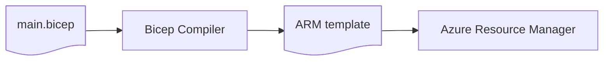
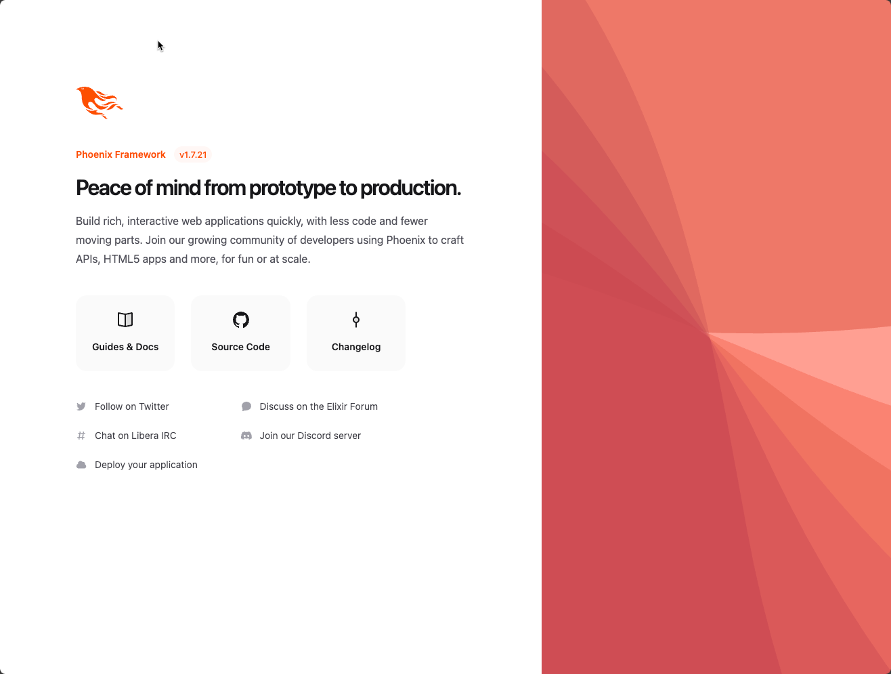

It's been a little longer than I had hoped since [my last article]({}), but it's not because I have not been working on new content. Maybe there was a slight return of writer's block, but it was mostly frustration as I was attempting to learn something new. And in attempting to learn something new, I actually succeeded, so here I am, back to write about my latest success.

## The Key Tenet

Back in my Windows developer days, I was an avid reader of [Visual Studio Magazine](https://visualstudiomagazine.com/home.aspx). Of all of the articles that I read, one really stuck with me and defined my whole product development philosphy. In his article [So Long and Thanks for All the Manifestos](https://visualstudiomagazine.com/articles/2013/06/01/so-long-and-thanks-for-the-all-the-manifestos.aspx), David Starr simplified the goals of the Agile methodology to three key tenets:

1. Ship often
2. Keep quality high
3. Solicit and respond to feedback

I value all three of these tenets, but "Ship Often" has stuck with me the most. I've been part of long product development projects. I've been through death marches and stressful crunch times at the end of projects as we aim to hit some arbitrary deadline to ship a product. Those don't work. Deadlines don't work. They just add stress.

The hardest release that you ever do for any product is the first release. After the first release goes out, it's easy after that. If you find a bug, you fix it and ship it. If you add a cool new feature, you ship it. Shipping stuff after you get your product out there in the market is a piece of cake. But building up the bravery to ship something the first time is extremely nerve wracking. What if the first release isn't perfect? First impressions are so important. Yes, they are, but maybe we're thinking of it wrong.

I've started shipping new apps that do absolutely nothing. In this article, I'm going to ship and deploy an application that's going to show the standard welcome screen for developers new to the Phoenix Framework. Whenever I start a new iPhone application, the first version that I ship to TestFlight is basically just a "hello, world!" screen. I don't wait for the first feature. I ship what I have.

The objective is not to ship the first feature. The objective is to build a culture that values shipping and releasing new software constantly. If I get a dummy starter application running in production, I now have a vehicle through which I can ship my first feature for people to use. By focusing on shipping first, I'm not going to invest a lot into building a new fantastic feature only to run into a brick wall because I don't know how to get that feature out. With a cloud application, by shipping first, I'm spending time up front designing what my production environment could look like. It's going to evolve and change, but I'm doing the heavy lifting to begin with. If I have to add services or refactor as I go along, I'll do so, but I'm dealing with the hard stuff up front. This makes shipping my initial set of features much easier.

## What am I Shipping?

Now that I have covered the importance of shipping often, what is it that I'm planning to ship and writing about? I'm shipping a web application that is going to run in [Microsoft Azure](https://azure.microsoft.com). Specifically, this is the first component of a microservice-based product that I am building, but the first component is going to be the web application that users will go to in their web browsers to access the product.

My technology of choice for the web application is [Elixir](https://elixir-lang.org/) and [Phoenix Framework](https://www.phoenixframework.org/). I've long been a fan of these two technologies, so since I am building this product for me and not a customer, I'm going use the technologies that I want.

My deployment mechanism of choice for the web application is to use [Docker container images](https://www.docker.com). Elixir applications are compiled to byte code and run by a virtual machine known as [BEAM](https://en.wikipedia.org/wiki/BEAM_(Erlang_virtual_machine)). BEAM was first created for [Erlang](https://www.erlang.org/), but has now been adopted by Elixir as well. But just like other virtual machine-based languages like Java and C#, I can't just distribute my compiled application files. I must also distribute the BEAM runtime and Erlang and Elixir standard libaries because my applicaiton will need them to run.

Finally, my target deployment environment is [Azure Container Apps](https://learn.microsoft.com/en-us/azure/container-apps/overview), a modern serverless platform that is designed around microservice execution. Azure Container Apps uses [Kubernetes](https://kubernetes.io/) to run containers, but scales elastically up or down in a serverless fashion based on the needs of the product.

## Target Architecture

My goal is that I want to build and ship my first product release into an environment that is _production quality_. Security features should be set up to provide users and potential future customers that I am taking their data confidentiality seriously. The Azure architecture I ended up with in my little exploration is illustrated in the figure below:

I started off creating a virtual network with two subnets. The `apps` subnet hosts the Azure Container Apps environment. The environment is basically a Kubernetes cluster that is managed automatically by Azure Container Apps. The second `services` subnet is intended to host private endpoints that will expose application services like Azure Key Vault and the PostgreSQL database server securely accessible to my container apps running in the `apps` subnet. By using private endpoints, I can keep my Azure services inaccessible to the public Internet and other Azure subscriptions and only my container apps will be able to access the database or other services.

## Provisioning the Azure Environment

To provision the resources for my production environment in Microsoft's Azure Cloud, I am using [Azure Developer CLI](https://learn.microsoft.com/en-us/azure/developer/azure-developer-cli/). Azure Developer CLI is a wonderful tool that supports running Bicep scripts to provision resources as well as deploying applications to Azure. Azure Developer CLI, or __AZD__, can be used both in development environments and as part of a continuous delivery process such as a GitHub Actions workflow.

Getting started with AZD is easy as you can use it to generate a starting point by opening a terminal and running:

    azd init

Running `azd init` will give you a few options. I always go with "Create a minimal project." This option will create the simplest set of starter files to begin with. `azd init` will prompt you for an environment name. This can be the name of the product you are working on. I usually use a product identifier and an environment specifier. The environment specifier is typically something like `dev`, `test`, or `prod`. For my initial application, I'm going to use this for a time tracking app that I want to build, so I'm going to use the environment name of `time-prod`.

Why use `prod` for the environment? Why am I not using `dev`? This goes back to the [ship often](#the-key-tenet) tenent. I want users to use this, and yes, I may be doing development in my production environment for a little bit, and that's ok. I can always later move to a `dev` environment when I feel it is necessary. But with no users, it's not worth paying for multiple environments quite yet.

After `azd init` finishes, I am left with an `infra` subdirectory and an `azure.yaml` file. The `infra` subdirectory is used to store the Bicep templates that will be used to provision and configure Azure resources for my product. The `azure.yaml` file lists the information about the applications or microservices that I will be deploying to Azure. I'm going to start by focusing on the `infra` subdirectory first to implement my [architecture](#target-architecture).

`azd init` gave me two files in the `infra` subdirectory: `main.bicep` and `main.parameters.json`. The `main.bicep` script is the starter Bicep template that we will edit to provision Azure resources. The `main.parameters.json` file lists arguments that we can pass into the execution of `main.bicep` to customize how Azure resources are created. Bicep actually has two supported formats for parameter files, and I like the other one better, so I am going to delete `main.parameters.json` and replace it with `main.bicepparam`:


using './main.bicep'

param environmentName = readEnvironmentVariable('AZURE_ENV_NAME', 'time-prod')
param location = readEnvironmentVariable('AZURE_LOCATION', 'centralus')


Before I dive into Bicep and start declaring my Azure resources, Microsoft's [Cloud Adoption Framework](https://learn.microsoft.com/en-us/azure/cloud-adoption-framework/) recommends using [abbrevations for resource types](https://learn.microsoft.com/en-us/azure/cloud-adoption-framework/ready/azure-best-practices/resource-abbreviations) in your resource names. Azure naming rules for resources is unfortunately not consistent and uniform across Azure. By using abbreviation prefixes for the resource type in the resource name, it can help you to distinguish and understand different resources based on their names. To make it easier to use these abbrevations in your resource names, I stole a list of the abbreviations from templates available from [Awesome AZD](https://azure.github.io/awesome-azd/) and add them to my `infra` directory as `abbreviations.json`:


{
    "analysisServicesServers": "as",
    "apiManagementService": "apim-",
    "appConfigurationStores": "appcs-",
    "appManagedEnvironments": "cae-",
    "appContainerApps": "ca-",
    "authorizationPolicyDefinitions": "policy-",
    "automationAutomationAccounts": "aa-",
    "blueprintBlueprints": "bp-",
    "blueprintBlueprintsArtifacts": "bpa-",
    "cacheRedis": "redis-",
    "cdnProfiles": "cdnp-",
    "cdnProfilesEndpoints": "cdne-",
    "cognitiveServicesAccounts": "cog-",
    "cognitiveServicesFormRecognizer": "cog-fr-",
    "cognitiveServicesTextAnalytics": "cog-ta-",
    "cognitiveServicesSpeech": "cog-sp-",
    "computeAvailabilitySets": "avail-",
    "computeCloudServices": "cld-",
    "computeDiskEncryptionSets": "des",
    "computeDisks": "disk",
    "computeDisksOs": "osdisk",
    "computeGalleries": "gal",
    "computeSnapshots": "snap-",
    "computeVirtualMachines": "vm",
    "computeVirtualMachineScaleSets": "vmss-",
    "containerInstanceContainerGroups": "ci",
    "containerRegistryRegistries": "cr",
    "containerServiceManagedClusters": "aks-",
    "databricksWorkspaces": "dbw-",
    "dataFactoryFactories": "adf-",
    "dataLakeAnalyticsAccounts": "dla",
    "dataLakeStoreAccounts": "dls",
    "dataMigrationServices": "dms-",
    "dBforMySQLServers": "mysql-",
    "dBforPostgreSQLServers": "psql-",
    "devicesIotHubs": "iot-",
    "devicesProvisioningServices": "provs-",
    "devicesProvisioningServicesCertificates": "pcert-",
    "documentDBDatabaseAccounts": "cosmos-",
    "eventGridDomains": "evgd-",
    "eventGridDomainsTopics": "evgt-",
    "eventGridEventSubscriptions": "evgs-",
    "eventHubNamespaces": "evhns-",
    "eventHubNamespacesEventHubs": "evh-",
    "hdInsightClustersHadoop": "hadoop-",
    "hdInsightClustersHbase": "hbase-",
    "hdInsightClustersKafka": "kafka-",
    "hdInsightClustersMl": "mls-",
    "hdInsightClustersSpark": "spark-",
    "hdInsightClustersStorm": "storm-",
    "hybridComputeMachines": "arcs-",
    "insightsActionGroups": "ag-",
    "insightsComponents": "appi-",
    "keyVaultVaults": "kv-",
    "kubernetesConnectedClusters": "arck",
    "kustoClusters": "dec",
    "kustoClustersDatabases": "dedb",
    "loadTesting": "lt-",
    "logicIntegrationAccounts": "ia-",
    "logicWorkflows": "logic-",
    "machineLearningServicesWorkspaces": "mlw-",
    "managedIdentityUserAssignedIdentities": "id-",
    "managementManagementGroups": "mg-",
    "migrateAssessmentProjects": "migr-",
    "networkApplicationGateways": "agw-",
    "networkApplicationSecurityGroups": "asg-",
    "networkAzureFirewalls": "afw-",
    "networkBastionHosts": "bas-",
    "networkConnections": "con-",
    "networkDnsZones": "dnsz-",
    "networkExpressRouteCircuits": "erc-",
    "networkFirewallPolicies": "afwp-",
    "networkFirewallPoliciesWebApplication": "waf",
    "networkFirewallPoliciesRuleGroups": "wafrg",
    "networkFrontDoors": "fd-",
    "networkFrontdoorWebApplicationFirewallPolicies": "fdfp-",
    "networkLoadBalancersExternal": "lbe-",
    "networkLoadBalancersInternal": "lbi-",
    "networkLoadBalancersInboundNatRules": "rule-",
    "networkLocalNetworkGateways": "lgw-",
    "networkNatGateways": "ng-",
    "networkNetworkInterfaces": "nic-",
    "networkNetworkSecurityGroups": "nsg-",
    "networkNetworkSecurityGroupsSecurityRules": "nsgsr-",
    "networkNetworkWatchers": "nw-",
    "networkPrivateDnsZones": "pdnsz-",
    "networkPrivateLinkServices": "pl-",
    "networkPublicIPAddresses": "pip-",
    "networkPublicIPPrefixes": "ippre-",
    "networkRouteFilters": "rf-",
    "networkRouteTables": "rt-",
    "networkRouteTablesRoutes": "udr-",
    "networkTrafficManagerProfiles": "traf-",
    "networkVirtualNetworkGateways": "vgw-",
    "networkVirtualNetworks": "vnet-",
    "networkVirtualNetworksSubnets": "snet-",
    "networkVirtualNetworksVirtualNetworkPeerings": "peer-",
    "networkVirtualWans": "vwan-",
    "networkVpnGateways": "vpng-",
    "networkVpnGatewaysVpnConnections": "vcn-",
    "networkVpnGatewaysVpnSites": "vst-",
    "notificationHubsNamespaces": "ntfns-",
    "notificationHubsNamespacesNotificationHubs": "ntf-",
    "operationalInsightsWorkspaces": "log-",
    "portalDashboards": "dash-",
    "powerBIDedicatedCapacities": "pbi-",
    "purviewAccounts": "pview-",
    "recoveryServicesVaults": "rsv-",
    "resourcesResourceGroups": "rg-",
    "searchSearchServices": "srch-",
    "serviceBusNamespaces": "sb-",
    "serviceBusNamespacesQueues": "sbq-",
    "serviceBusNamespacesTopics": "sbt-",
    "serviceEndPointPolicies": "se-",
    "serviceFabricClusters": "sf-",
    "signalRServiceSignalR": "sigr",
    "sqlManagedInstances": "sqlmi-",
    "sqlServers": "sql-",
    "sqlServersDataWarehouse": "sqldw-",
    "sqlServersDatabases": "sqldb-",
    "sqlServersDatabasesStretch": "sqlstrdb-",
    "storageStorageAccounts": "st",
    "storageStorageAccountsVm": "stvm",
    "storSimpleManagers": "ssimp",
    "streamAnalyticsCluster": "asa-",
    "synapseWorkspaces": "syn",
    "synapseWorkspacesAnalyticsWorkspaces": "synw",
    "synapseWorkspacesSqlPoolsDedicated": "syndp",
    "synapseWorkspacesSqlPoolsSpark": "synsp",
    "timeSeriesInsightsEnvironments": "tsi-",
    "webServerFarms": "plan-",
    "webSitesAppService": "app-",
    "webSitesAppServiceEnvironment": "ase-",
    "webSitesFunctions": "func-",
    "webStaticSites": "stapp-"
}


I next jump into the `main.bicep` file and start allocating Azure resources for my product:


targetScope = 'subscription'

@minLength(1)
@maxLength(64)
@description('Name of the environment that can be used as part of naming resource convention')
param environmentName string

@minLength(1)
@description('Primary location for all resources')
param location string

var abbrs = loadJsonContent('./abbreviations.json')

var resourceToken = toLower(uniqueString(subscription().id, environmentName, location))

// Tags that should be applied to all resources.
// 
// Note that 'azd-service-name' tags should be applied separately to service host resources.
// Example usage:
//   tags: union(tags, { 'azd-service-name': <service name in azure.yaml> })
var tags = {
  'azd-env-name': environmentName
}

resource rg 'Microsoft.Resources/resourceGroups@2022-09-01' = {
  name: 'rg-${environmentName}'
  location: location
  tags: tags
}


Focus on the highlighted lines in the code block above. First, I declared the `abbrs` variable and I initialize it by calling the Bicep `loadJsonContent` function to read and deserialize the list of abbreviations that I just created. `loadJsonContent` will read the JSON content in `abbreviations.json` and will store an object containing the data in the document in the `abbrs` variable. We can then use `abbrs` later when allocating resources to use the abbreviations when building the names of the resources.

The `resourceToken` variable is also kind of nifty. This is a unique, but rebuildable, string that is generated by hashing the Azure subscription identifier, environment name, and deployment location. `resourceToken` helps us to support multiple deployments of the product without resource names conflicting. By using `resourceToken` in our Azure resource names, it helps to keep one environment from conflicting with another.

Out of the box, the only thing that this Bicep script does is to create the resource group in my Azure account. I can run this script to test it out by using AZD:

    azd provision

`azd provision` will read `main.bicep` and any referenced modules, will connect to Azure, and will either create the resource group if it does not exist. I can make changes incrementally and run `azd provision` to update my Azure resource group and allocate, delete, or reconfigure Azure resources for my product.

## Bicep and Azure Verified Modules

As I mentioned earlier, Azure Developer CLI reads template specifications that are written in a domain-specific language called [Bicep](https://learn.microsoft.com/en-us/azure/azure-resource-manager/bicep/overview?tabs=bicep). Bicep is a programmer-friendly language for declaring and defining Azure resources and specifying how those resources should be configured. Bicep will compile the specification into templates that can be used by [Azure Resource Manager](https://learn.microsoft.com/en-us/azure/azure-resource-manager/management/overview) to provision and configure Azure resources.

Bicep is extensible and templatable using _modules_. Modules are witten in Bicep and are similar to functions in that they can have inputs and outputs. Developers can create their own reusable modules, but Microsoft also makes available a set of vetted modules called [Azure Verified Modules](https://azure.github.io/Azure-Verified-Modules/). There are verified modules for individual resources, but also modules that implement common Azure resource patterns. We'll make use of Azure Verified Modules in this article wherever possible.

## Provisioning Monitoring

The first Azure resources that I am going to provision are my monitoring resources. I will create a [Log Analytics workspace](https://learn.microsoft.com/en-us/azure/azure-monitor/logs/log-analytics-workspace-overview) to capture log output from the Azure services and from my microservices that are going to be deployed into Azure. I will also create an [Application Insights service](https://learn.microsoft.com/en-us/azure/azure-monitor/app/app-insights-overview) to capture telemetry and tracing information so that I can see how requests are handled by the product and monitor the performance of the product.

The Bicep definition is shown below:


@description('Name of the Application Insights dashboard to be created')
param applicationInsightsDashboardName string = ''

@description('Name of the Application Insights resource to be created')
param applicationInsightsName string = ''

@description('Name of the Log Analytics Workspace to be created')
param logAnalyticsWorkspaceName string = ''

// ...

module monitoring 'br/public:avm/ptn/azd/monitoring:0.1.1' = {
  name: 'monitoring'
  scope: rg
  params: {
    applicationInsightsDashboardName: !empty(applicationInsightsDashboardName) ? applicationInsightsDashboardName : '${abbrs.portalDashboards}${resourceToken}'
    applicationInsightsName: !empty(applicationInsightsName) ? applicationInsightsName : '${abbrs.insightsComponents}${resourceToken}'
    logAnalyticsName: !empty(logAnalyticsWorkspaceName) ? logAnalyticsWorkspaceName : '${abbrs.operationalInsightsWorkspaces}${resourceToken}'
    location: location
    tags: tags
  }
}


The general pattern for naming resources is that I define parameters such as `applicationInsightsName` that defaults to an empty string. If a developer or administrator has a specific need to control the name of the resource, then the Bicep template will use that name. Otherwise, a standard generated name will be used using the abbreviation of the resource and using the resource token to avoid conflicts with other similarly named resources.

## Provisioning the Virtual Network

I am using an Azure [Virtual Network](https://learn.microsoft.com/en-us/azure/virtual-network/virtual-networks-overview) to create an isolated and secure environment for my product to run in. When using a virtual network, I'm creating a closed environment running in the cloud where I can control which resources can be accessed from the public Internet. I can also use [Azure Private Link](https://learn.microsoft.com/en-us/azure/private-link/private-link-overview) to create secure connections between my virtual network and Azure cloud-native services that my product is going to use. For example, I can use Private Link to create a secure internal connection to my database so that I do not need to expose my database to the public Internet to be attacked, or exposed within the Azure network where it can be accessed by other Azure subscribers. This is shown in the diagram shown previously:

I can divide my virtual network into logical units called __subnets__. Subnets are part of the same virtual network and services can talk between subnets, but using subnets allows me to allocate parts of my virtual network for specific services. In this design, I am going to create two subnets. The first subnet is my application subnet and is where my product's services are going to run. My target hosting environment for my services is Azure Container Apps. By default, Azure Container Apps will create its own virtual network and will run Kubernetes inside of that virtual network. However, I am creating my own custom virtual network for Azure Container Apps because the default virtual network does not support the use of private endpoints to communicate with other Azure services.


@description('Name of the virtual network to be created')
param virtualNetworkName string = ''

// ...

module virtualNetwork 'br/public:avm/res/network/virtual-network:0.6.1' = {
  name: 'virtualNetwork'
  scope: rg
  params: {
    name: !empty(virtualNetworkName) ? virtualNetworkName : '${abbrs.networkVirtualNetworks}${resourceToken}'
    addressPrefixes: [
      '10.0.0.0/16'
    ]
    subnets: [
      {
        name: 'app'
        addressPrefix: '10.0.0.0/23'
      }
      {
        name: 'services'
        addressPrefix: '10.0.2.0/24'
      }
    ]
    location: location
    tags: tags
  }
}


My virtual network is scoped to the address prefix `10.0.0.0/16`. In the IPv4 address space, this my virtual network will recognize that IP addresses with the `10.0` prefix are routed internally to the virtual network and it allows for 65,534 addresses to be allocated and used for services within the virtual network. My `app` subnet uses the address prefix of `10.0.0.0/23`. This means that services running in the `app` subnet can use IP addresses `10.0.0.0` through `10.0.1.255`. `10.0.0.0/23` is the smallest address prefix that can be used for Azure Container Apps. More IP addresses may be necessary for larger solutions. The `services` subnet that will host my private endpoints uses the address prefix `10.0.2.0/24`. This address prefix makes available IP addresses `10.0.2.0` through `10.0.2.255` for Private Link services.

## Provisioning the Container Apps Environment

With the virtual network created, we can now create the Azure Container Apps Environment that will run Kubernetes and host microservices as Container Apps. The Container Apps Environment will be hosted in the virtual network in the `apps` subnet, and Container Apps Environment will have full control of that subnet. I am using an Azure Verified Module for creating the Container Apps Environment, and as a side effect of creating the Container Apps Environment, an [Container Registry](https://learn.microsoft.com/en-us/azure/container-registry/). The Container Registry will be used to host container images for the microservices to be deployed into the Container Apps environment. Updates to the hosted microservices can be published to the Container Registry, and Azure Container Apps can monitor the Container Registry to deploy the new versions of microservices.


module containerApps 'br/public:avm/ptn/azd/container-apps-stack:0.1.1' = {
  name: 'containerApps'
  scope: rg
  params: {
    containerAppsEnvironmentName: !empty(containerAppsEnvironmentName) ? containerAppsEnvironmentName : '${abbrs.appManagedEnvironments}${resourceToken}'
    containerRegistryName: !empty(containerRegistryName) ? containerRegistryName : '${abbrs.containerRegistryRegistries}${resourceToken}'
    logAnalyticsWorkspaceResourceId: monitoring.outputs.logAnalyticsWorkspaceResourceId
    acrAdminUserEnabled: true
    acrSku: 'Basic'
    appInsightsConnectionString: monitoring.outputs.applicationInsightsConnectionString
    daprAIInstrumentationKey: monitoring.outputs.applicationInsightsInstrumentationKey
    enableTelemetry: true
    infrastructureSubnetResourceId: virtualNetwork.outputs.subnetResourceIds[0]
    location: location
    tags: tags
    zoneRedundant: false
  }
}


## Provisioning the Database

While I'm not using it now, the starter Phoenix Framework web application is going to be looking for a database. I'm planning on using [PostgreSQL](https://www.postgresql.org/) right now for my SQL relational database storage, so I need to provision the PostgreSQL database:


module postgres 'br/public:avm/res/db-for-postgre-sql/flexible-server:0.11.0' = {
  name: 'postgres'
  scope: rg
  params: {
    name: !empty(postgresServerName) ? postgresServerName : '${abbrs.dBforPostgreSQLServers}${resourceToken}'
    skuName: 'Standard_B1ms'
    tier: 'Burstable'
    administratorLogin: postgresAdministratorLogin
    administratorLoginPassword: postgresAdministratorLoginPassword
    location: location
    tags: tags
    version: '16'
    highAvailability: 'Disabled'
    geoRedundantBackup: 'Disabled'
    privateEndpoints: [
      {
        subnetResourceId: virtualNetwork.outputs.subnetResourceIds[1]
        service: 'postgresqlServer'
        privateDnsZoneGroup: {
          privateDnsZoneGroupConfigs: [
            {
              privateDnsZoneResourceId: postgresPrivateDnsZone.outputs.resourceId
            }
          ]
        }
      }
    ]
  }
}


This Bicep module will provision a low-cost burstable SKU of PostgreSQL in Azure. This module will also provision and configure the private endpoint in the `services` subnet of the virtual network allowing my container apps to communicate with the PostgreSQL server securely and privately. The private endpoint will be assigned an IP address in the `services` subnet such as `10.0.2.4`, but programming against an IP address isn't a safe bet. Instead, it would be safer to use a DNS name. We can create a private DNS zone that is linked to the virtual network allowing name resolution to the IP address of the private endpoint. I define that private DNS zone:


module postgresPrivateDnsZone 'br/public:avm/res/network/private-dns-zone:0.7.1' = {
  name: 'postgresPrivateDnsZone'
  scope: rg
  params: {
    name: 'privatelink.postgres.database.azure.com'
    location: 'global'
    tags: tags
    virtualNetworkLinks: [
      {
        name: 'postgresPrivateDnsZoneLink'
        virtualNetworkResourceId: virtualNetwork.outputs.resourceId
        registrationEnabled: false
      }
    ]
  }
}


## Provisioning the Key Vault

Along with secure and private communication between my application services and cloud-native services like PostgreSQL, there's going to be a fair amount of secret data that my application services are going to need to know. For example, applications that use the PostgreSQL database need to know the password to use to connect to PostgreSQL. In Azure, secrets are managed in [Azure Key Vault](https://learn.microsoft.com/en-us/azure/key-vault/general/overview). These secrets can be accessed securely at runtime by applications. In addition, services such as Container Apps can also read Key Vault to extract necessary secrets and provide them to hosted programs using environment variables at runtime.

My Bicep definition for Key Vault is:


module keyVaultPrivateDnsZone 'br/public:avm/res/network/private-dns-zone:0.7.1' = {
  name: 'keyVaultPrivateDnsZone'
  scope: rg
  params: {
    name: 'privatelink.vaultcore.azure.net'
    location: 'global'
    tags: tags
    virtualNetworkLinks: [
      {
        name: 'keyVaultPrivateDnsZoneLink'
        virtualNetworkResourceId: virtualNetwork.outputs.resourceId
        registrationEnabled: false
      }
    ]
  }
}

module keyVault 'br/public:avm/res/key-vault/vault:0.12.1' = {
  name: 'keyVault'
  scope: rg
  params: {
    name: !empty(keyVaultName) ? keyVaultName : '${abbrs.keyVaultVaults}hub-${resourceToken}'
    enableRbacAuthorization: true
    privateEndpoints: [
      {
        subnetResourceId: virtualNetwork.outputs.subnetResourceIds[1]
        service: 'vault'
        privateDnsZoneGroup: {
          privateDnsZoneGroupConfigs: [
            {
              privateDnsZoneResourceId: keyVaultPrivateDnsZone.outputs.resourceId
            }
          ]
        }
      }
    ]
    secrets: [
      {
        name: 'EctoDatabaseURL'
        value: 'ecto://${postgresAdministratorLogin}:${postgresAdministratorLoginPassword}@${postgres.outputs.name}.privatelink.postgres.database.azure.com:5432/hub-prod'
      }
      {
        name: 'SecretKeyBase'
        value: secretKeyBase
      }
    ]
    roleAssignments: [
      {
        roleDefinitionIdOrName: 'Key Vault Secrets User'
        principalId: webIdentity.outputs.principalId
        principalType: 'ServicePrincipal'
      }
    ]
    sku: 'standard'
    enablePurgeProtection: false
    enableSoftDelete: false
    location: location
    tags: tags
  }
}

module webIdentity 'br/public:avm/res/managed-identity/user-assigned-identity:0.4.1' = {
  name: 'webIdentity'
  scope: rg
  params: {
    name: '${abbrs.managedIdentityUserAssignedIdentities}web-${resourceToken}'
    location: location
  }
}


There are actually three resources provisioned in the above code block. I am provisioning Key Vault. Just like with PostgreSQL above, my services can communicate with Key Vault using a private endpoint, so I am defining the private endpoint for the Key Vault in the `services` subnet of the virtual network. And just like the private endpoint for PostgreSQL, I am creating another private DNS zone to manage the name resolution for Key Vault resources.

Jumping ahead, I'm creating a user-assigned identity that my web application will act as. I'm showing it here because I am registering that identity with Key Vault so that my web application can read secret values from Key Vault at runtime.

Notice that when I provision the Key Vault, I am also creating and initializing the initial set of secrets:

- `EctoDatabaseURL`: the URL that Ecto, the database layer for my Phoenix Framework web application, will use to connect to the PostgreSQL database
- `SecretKeyBase`: the secret key that Phoenix will use to encrypt or sign important information

These will be used by the web Container App, which we will create next.

## Provisioning the App

At this point, almost all of the infrastructure has been provisioned using Bicep. The final step is to provision the Container App for my web application:


module web 'br/public:avm/ptn/azd/container-app-upsert:0.1.2' = {
  name: 'web'
  scope: rg
  params: {
    name: !empty(webAppName) ? webAppName : '${abbrs.appContainerApps}web-${resourceToken}'
    containerAppsEnvironmentName: containerApps.outputs.environmentName
    containerRegistryName: containerApps.outputs.registryName
    containerMaxReplicas: 1
    containerMinReplicas: 1
    targetPort: 4000
    env: [
      {
        name: 'DATABASE_URL'
        secretRef: 'ecto-database-url'
      }
      {
        name: 'SECRET_KEY_BASE'
        secretRef: 'secret-key-base'
      }
    ]
    secrets: {
      secureList: [
        {
          name: 'ecto-database-url'
          keyVaultUrl: keyVault.outputs.secrets[0].uri
          identity: webIdentity.outputs.resourceId
        }
        {
          name: 'secret-key-base'
          keyVaultUrl: keyVault.outputs.secrets[1].uri
          identity: webIdentity.outputs.resourceId
        }
      ]
    }
    identityType: 'UserAssigned'
    identityName: webIdentity.name
    userAssignedIdentityResourceId: webIdentity.outputs.resourceId
    identityPrincipalId: webIdentity.outputs.principalId
    location: location
    tags: union(tags, { 'azd-service-name': 'web' })
  }
}


This specification will provision the Container App for my Phoenix web application. Initially, I'm configuring the Container App Environment to run no more than 1 replica of the web application. Later, that will be increased to handle customer load, but at the moment, more than one replica is not necessary. I'm also referencing the secrets in Key Vault. When the Container App runs my web application, it will read the `EctoDatabaseURL` and `SecretKeyBase` secrets and injecting them into the web application using the `DATABASE_URL` and `SECRET_KEY_BASE` environment variables for Phoenix to use.

At this point, I can now run the `azd provision` command to provision and configure all of my Azure resources. Once that is done, I can deploy and run my web application in Azure.

## One Last Step

Before we deploy our web application to Azure, we need to create the application's database in the PostgreSQL server. The easiest way to do this, at least initially, is to go into [Azure Portal](https://portal.azure.com) and access your PostgreSQL database server service. From there, follow these steps:

1. Go to the Networking tab on the left side of the screen.
1. Check the `Allow public access to this resource through the Internet using a public IP address` option.
1. Save the change. This may take a couple of minutes to complete the update.
1. After the page refreshes, click on the `Add current client IP address` option to allow your machine to access the PostgreSQL server through the firewall.
1. Save the change and wait for the change to update the service.

After this change is done, you should be able to access the PostgreSQL server from your development machine. This will allow you to create the database or apply migrations in the next section.

## Deploying the Phoenix Web Application

Most of the hard work is done now. We have used Azure Developer CLI and Bicep to provision a resource group and all of the resources that are needed to run the web application. Now it's time to deploy it and see it in action. I'm not going to go into how to install Elixir and Phoenix, but if you need that, you can find the installation instructions [here](https://hexdocs.pm/phoenix/installation.html).

Assuming that Phoenix and Elixir are installed, I'm going to create a simple starter web application. I'm going to call the new application `hub`, but you can name yours whatever you want:

    mix phx.new hub

This command will create a new `hub` subdirectory containing the starter Phoenix application. I'm not going to modify anything in the starter application except for the configuration in the `config/runtime.exs` script. Open that file in a text editor and look for the line `config :hub, Hub.Repo,` around line 33. What we have to modify here is configure SSL support for the database connection to PostgreSQL. In Azure, communication with PostgreSQL is going to require TLS/SSL to encrypt data transferred between the application and the database server. In TLS, the PostgreSQL server has a private key and a public key certificate that are used for authenticating the PostgreSQL server to the client application. In order to complete the authentication, our web application needs to have a signing certificate or root certificate that can be used to authenticate the server. In a later post, I will update the code to do that verification, but for the time being, I'm going to turn off verification. This isn't a long term solution, but it's a bigger discussion than I want to do in this already long post. So for now, update that code to look like this:


    config :hub, Hub.Repo,
        ssl: [
            verify: :verify_none
        ],
        url: database_url,
        pool_size: String.to_integer(System.get_env("POOL_SIZE") || "10"),
        socket_options: maybe_ipv6


With that taken care of, let's prepare the web application for deployment. We are going to use Docker to build a container image. For an Elixir application, we need to deploy not only our web application's files, but also the BEAM virtual machine and Elixir and Erlang standard libraries. Fortunately, Elixir (and Erlang) make this super simple using [Releases](https://hexdocs.pm/phoenix/releases.html).

First, we're going to need to set up some environment variables:


export SECRET_KEY_BASE=$(mix phx.gen.secret)
export DATABASE_URL="ecto://<postgres-user>:<postgres-password>@<postgres-fqdn>:5432/hub_prod"


You will need to replace the values in the above code block with the values for your environment. With this done, we need to create the application's database in PostgreSQL. This can be done by running the following command:

    MIX_ENV=prod mix ecto.create

This command will use the `DATABASE_URL` environment variable to connect to the Azure PostgreSQL server and create the `hub_prod` database. With the database created, we can now generate the release. Run these commands:


MIX_ENV=prod mix compile
MIX_ENV=prod mix assets.deploy
mix phx.gen.release --docker


The last command, `mix phx.gen.release --docker`, will add the artifacts necessary to build a release of the web application. The `--docker` argument will ask Releases to generate the `Dockerfile` to build and containerize the application. The generated `Dockerfile` will use a multi-stage build to build the production release of the application and then copy the release artifactss into a Docker container image that can be deployed.

Now that we're set up to generate releases of the web application, we can use AZD to deploy it to its Container App. Back at the beginning of this document, we saw that `azd init` generated an `azure.yaml` file in the root project directory. We can go edit that now. Here's what my `azure.yaml` file looks like:


name: hub

services:
  web:
    project: src/hub
    host: containerapp
    language: js


`azure.yaml` tells AZD what applications need to be deployed to Azure. We define the `web` application that will deploy the Phoenix web application to Azure. The `language` field is required, but is not used in this case. AZD will see that `web` is being deployed to Container Apps (`host: containerapp`) and will see the `Dockerfile` in the `src/hub` subdirectory where I stored my Phoenix application. AZD will then use Docker to build the container image to be deployed.

After AZD builds the Docker image, AZD will look at the Container Apps in Azure. Here's the Bicep definition from earlier:


module web 'br/public:avm/ptn/azd/container-app-upsert:0.1.2' = {
  name: 'web'
  scope: rg
  params: {
    name: !empty(webAppName) ? webAppName : '${abbrs.appContainerApps}web-${resourceToken}'
    containerAppsEnvironmentName: containerApps.outputs.environmentName
    containerRegistryName: containerApps.outputs.registryName
    containerMaxReplicas: 1
    containerMinReplicas: 1
    targetPort: 4000
    env: [
      {
        name: 'DATABASE_URL'
        secretRef: 'ecto-database-url'
      }
      {
        name: 'SECRET_KEY_BASE'
        secretRef: 'secret-key-base'
      }
    ]
    secrets: {
      secureList: [
        {
          name: 'ecto-database-url'
          keyVaultUrl: keyVault.outputs.secrets[0].uri
          identity: webIdentity.outputs.resourceId
        }
        {
          name: 'secret-key-base'
          keyVaultUrl: keyVault.outputs.secrets[1].uri
          identity: webIdentity.outputs.resourceId
        }
      ]
    }
    identityType: 'UserAssigned'
    identityName: webIdentity.name
    userAssignedIdentityResourceId: webIdentity.outputs.resourceId
    identityPrincipalId: webIdentity.outputs.principalId
    location: location
    tags: union(tags, { 'azd-service-name': 'web' })
  }
}


Notice the `tags` field at the bottom. We added the `azd-service-name` tag and set its value to `web`. AZD will search for that tag and will match the application name from `azure.yaml` with the value of the `azd-service-name` to determine which Container App to deploy the application to.

With `azure.yaml` updated, we can deploy the web application:

    azd deploy web

This command will build the web application, produce the Docker container image, upload the container image to the Azure Container Registry, and then promote the container image to the web Container App.

### Note for Developers using MacBook Pros

I use Apple MacBook Pro computers with Apple M3 or M4 chips. These processors use the ARM architecture. Azure's runtime environment is based on Intel x64 architecture chips. Given that, I cannot directly build a Docker container on my machine that can be deployed to Azure Container Apps. To get around this, I use GitHub Actions to build and deploy my web application to Azure.

First, you need to register a federated user account that will allow GitHub Actions to deploy your applications to Azure. This can be automated by running the following AZD command:

    azd pipeline config

This command will communicate with the Entra ID tenant for your Azure subscription to register a new federated user associated with GitHub. AZD will then save the settings as variables and secrets for GitHub Actions in your GitHub repository.

I then created a GitHub Actions workflow to do the deployment:


name: Deploy Hub

on:
  workflow_dispatch:

jobs:
  deploy:
    name: Deploy Hub Application
    runs-on: ubuntu-latest
    env:
      AZURE_CLIENT_ID: ${{ vars.AZURE_CLIENT_ID }}
      AZURE_TENANT_ID: ${{ vars.AZURE_TENANT_ID }}
      AZURE_SUBSCRIPTION_ID: ${{ vars.AZURE_SUBSCRIPTION_ID }}
      AZURE_ENV_NAME: ${{ vars.AZURE_ENV_NAME }}
      AZURE_LOCATION: ${{ vars.AZURE_LOCATION }}
    permissions:
      id-token: write
      contents: read
    steps:
      - name: Checkout
        uses: actions/checkout@v4
      - name: Install azd
        uses: Azure/setup-azd@v2
      - name: Log in with Azure (Federated Credentials)
        run: |
          azd auth login `
            --client-id "$Env:AZURE_CLIENT_ID" `
            --federated-credential-provider "github" `
            --tenant-id "$Env:AZURE_TENANT_ID"
        shell: pwsh
      - name: Deploy the Web Application
        run: azd deploy web --no-prompt
        env:
          AZD_INITIAL_ENVIRONMENT_CONFIG: ${{ secrets.AZD_INITIAL_ENVIRONMENT_CONFIG }}
          AZURE_CONTAINER_REGISTRY_ENDPOINT: ${{ vars.AZURE_CONTAINER_REGISTRY_ENDPOINT }}


This workflow will install AZD, log into Azure using the federated user account, and use AZD to deploy the web application to Azure. I can manually kick off this command from GitHub or using [GitHub CLI](https://cli.github.com):

    gh workflow run web.yaml

## View Your Web Application

At this point, your Azure environment is complete and your Phoenix web application should be deployed and accessible. Go to the Azure Portal, look up the Container App, get the public URL, and open it in a web browser and you should see the Phoenix web application running.

## Where Are We?

This was a long article, but there was a lot of work that went into this just to ship. We can't just build and deploy the application since it's going into Azure. We have to set up the Azure environment to be ready to run it, and I wanted to do it how I feel is the right and most secure way for a production environment.

In this article, I have covered the minimal setup for hosting a Phoenix web application in Azure using Azure Container Apps. I showed how to create a repeatable provisioning process using Azure Developer CLI and Bicep. Finally, I showed you how to use Azure Developer CLI to deploy a Phoenix web application to a Container App.

While the focus of this article is for deploying a Phoenix/Elixir web application, most of this would also apply to deploying an ASP.NET, Go, or Node.js application to Azure Container Apps. But most importantly, I wanted to show that it is possible to run a Phoenix/Elixir application in Azure using Container Apps. So if you're doing Phoenix and Elixir development, go forth and play now.

The source code for this article is available in my [GitHub Repository](https://github.com/mfcollins3/phoenix-container-app-sample).
