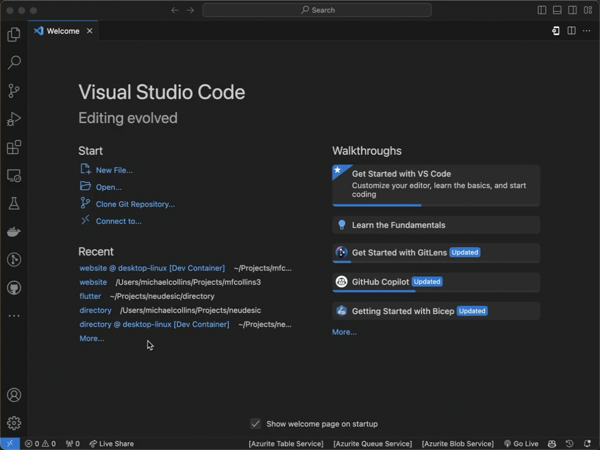
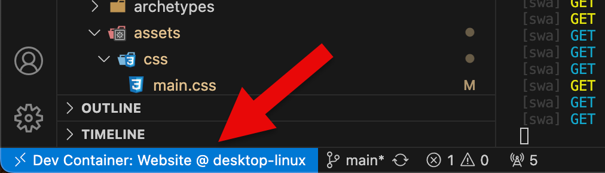
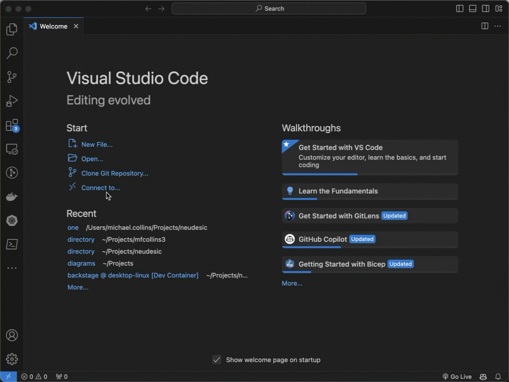

:source-highlighter: rouge
:rouge-linenums-mode=inline:

As a developer, I am typically a little slow to adopt new tools and technologies that are going to cost me significant money. As a married father of three, there are always new clothes or shoes to buy for the kids as they constantly grow, and my teenage son eats about two tons of food per day as he is growing to 6+ feet at the tender age of thirteen. I try to be very careful about what I spend my money on. I do not mind spending a few dollars here and there on subscriptions that I get value out of. I also love free tier services such as those that Microsoft Azure and Amazon Web Services offer. For example, what I love about building serverless applicatons in the cloud is the generous free tier services for Azure Functions, or the low cost consumption models for other _serverless_ technologies. I don't want to spend $200 to host a database with a dedicated virtual machine, for example, when I can spend one or two dollars instead on paying for a serverless consumption model database.

When I first became aware of the concept of devcontainers, it was in relation to https://github.com/features/codespaces[GitHub Codespaces]. It sounds cool: create a fully configured development environment that you can host in the cloud and access from anywhere. You can share the container image with other team members and everyone can work on them together. That sounded great! Then I looked at the pricing for this service and did some real math. At the time of publishing, GitHub offers 60 hours free each month, which is wonderful. But I work on average about 60 hours a week on professional stuff, and if I am lucky I can squeeze in another 10 to 20 on personal work. So that free tier will last me less than one week. If I assume 80 hours per week and an average of 4.5 weeks per month, that's 360 hours per month. After the 60 free hours for a 2 core virtual machine, my cost would be $54 per month. That's not too bad, but if I need a 4 core virtual machine, my free hours drop to 30 and my monthly cost now becomes $118.80 per month, so it can add up. And this is on top of the $303.58 that I am paying in monthly installments for my powerful MacBook Pro 16" with the M3 Max chip and 64GB of RAM. With my MacBook Pro M3, I have I have 10 cores. What do I get from paying for a 2 core virtual machine?

What I missed in this exploration was that devcontainers do not need to be isolated to running on virtual machines in Codespaces or the cloud. Devcontainers can also be used locally and solve a whole bunch of problems. Devcontainers at their core are basically https://docker.com[Docker] containers. When working on projects at work, I spend an incredible amount of time writing documentation up front on how new developers can jump in and help me. A big step of this is documenting exactly what all of the software requirements are and how they have to be installed. An inevitably, at least one developer is not going to read this documentation and will not understand why Ruby is not working correctly or a Node.js script is not working right because they're using the wrong version of Node.js or using the version of Ruby that comes with macOS. Devcontainers solve this problem by providing a consistent development environment. I can preconfigure the devcontainers to have all of the tools and languages that developers need to use. I can configure the file system to be consistent. I can configure the right versions of all of the tools that developers working with me should be using. I can even configure the devcontainer to have the right extensions installed in Visual Studio Code. Devcontainers are also supported by other tools such as the JetBrains IDEs and Visual Studio on Windows. All that a new developer needs to do is to clone the GitHub repository, start the devcontainer, and begin working.

Now Devcontainers don't solve all problems. Devcontainers are limited right now only to Linux-based containers. My team cannot use a devcontainer to build an iOS application for example. But for web development and cloud or server development where most server-side applications are going to be running in a Linux environment, devcontainers are an incredible timesaver and productivity tool.

== Getting Started with Devcontainers

Devcontainers do not do away with software requirements prerequisites, but they do minimize the requirements. First, running Devcontainers locally does require that https://docker.com[Docker] is installed on your local machine. Outside of that, you need https://code.visualstudio.com[Visual Studio Code] or a supporting IDE such as the https://jetbrains.com[JetBrains] IDEs or Visual Studio on Windows. For Visual Studio Code, you also need to install the https://marketplace.visualstudio.com/items?itemName=ms-vscode-remote.remote-containers[Remote - Containers] extension in Visual Studio Code.

To add a Devcontainer to an existing project or to start a new project in a Devcontainer, you just have to create a `.devcontainer` directory in the root directory of your project reponsitory. Inside of this directory, you need to create a `devcontainer.json` file that will describe how the Devcontainer should be built. I use a Devcontainer to build my blog, and the https://github.com/mfcollins3/website/blob/main/.devcontainer/devcontainer.json[`devcontainer.json`] file looks like this:

[,json,linenums]
----
include::../.devcontainer/devcontainer.json[]
----

The structure of `devcontainer.json` is documented in the https://containers.dev/implementors/spec/#devcontainerjson[specification], but here's a short description from my example. The `image` property specifies the base Docker image that will be used to create the base container. There are many different base containers out there that include specific technologies, but I have chosen to use a https://mcr.microsoft.com/en-us/product/devcontainers/base/about[generic base container from Microsoft] that is based on Debian Linux 12 (Bookworm).

The `features` property lists a set of features that should be included in the devcontainer. Features can be used to install and configure additional development tools such as compilers or interpreters for programming languages, https://gohugo.io[Hugo] for generating my website, or other libraries or open source tools. In my container, I am adding a feature that installs Hugo for me, a feature that installs Node.js, and a feature that installs Ruby.

The `forwardPorts` property tells the Devcontainer host (Visual Studio Code, JetBrains IDE) what TCP/IP ports the programs that I am building or in the Devcontainer are going to listen to. This allows me to connect to the services running on those ports from my local machine. For example, Hugo runs its development server on TCP/IP port 1313. I forward that port so that I can open a local web browser like Apple Safari or Microsoft Edge and preview my website as I am building it or writing new content.

The `customizations` property allows me to add customizations for specific Devcontainer hosts that will run inside of the Devcontainer. For example, I can add customizations for Visual Studio Code that will install specific extensions that I need to use. This means that every other developer that is using the same devcontainer will have access to the exact same tools and extensions in Visual Studio Code that I am using.

I also have a `postCreateCommand` property allows me to specify a shell script in the repository that will be run after the Devcontainer is created. I can use this script to install dependencies inside of the devcontainer. For example, my website depends on tools that use both Node.js and Ruby, so I can use the script to install the Node.js dependencies using NPM or install the Ruby development tools using https://bundler.io[Bundler]. By having the devcontainer run this script automatically, every developer gets a perfectly configured development environment by just opening the devcontainer and they are not required to run any additional commands.

== Running the Devcontainer

Running the Devcontainer is fairly easy but also depends on the development tool that you are using. For the purpose of this article, I will demonstrate how to run the Devcontainer in Visual Studio Code. If you have a local repository that has a `.devcontainer` subdirectory, you can open the repository directory in Visual Studio Code as a workspace. Visual Studio Code will automatically detect the presence of the Devcontainer and will ask you if you want to re-open the workspace inside of the Devcontainer:

If you click the "Reopen in Container" button, Visual Studio Code will start building the Devcontainer. This process can take a few minutes as the base container image is downloaded and the features are installed. Once the Devcontainer is built, Visual Studio Code will open a new window that is running inside of the Devcontainer. You can tell that you are inside of the Devcontainer by looking at the bottom left corner of the Visual Studio Code window. You will see the name of the Devcontainer that you are running in:

If your repository is cloned in a reachable location such as on GitHub, you can let Visual Studio Code create the devcontainer from the repository and build it locally.

== Conclusion

Using Devcontainers for local development has been a big productivity booster and a game changer for personal development and team development. Being able to create a reusable, standardized environment that can run on the hardware that I and my development team currently have solves so many problems. The biggest productivity booster is where my team is working in a heterogeneous environment with some using Macs and others using Windows laptops. When building cloud-hosted solutions that will run in a Linux environment, Devcontainers provide us with a standardized development environment that works equally well on all of our machines. That Devcontainers can also be upscaled to run in GitHub Codespaces to let you develop from anywhere is a killer feature. Check out Devcontainers and get started using them today!
